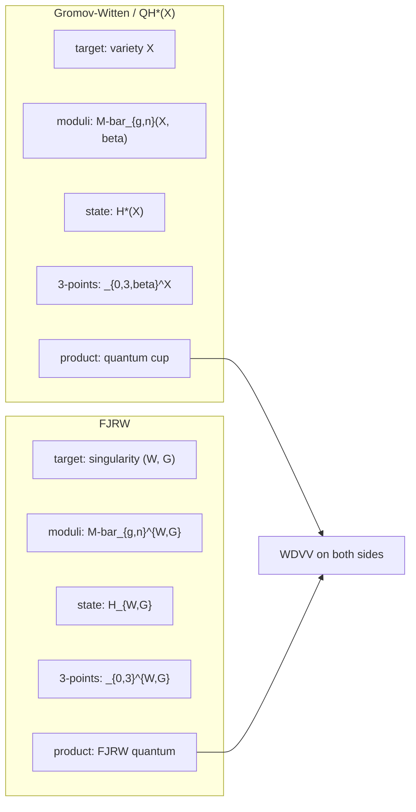

# Gromov–Witten / QH*(X) versus FJRW

Author: Benjamin Stanley Frohman.
Copyright (c) 2026 Benjamin Stanley Frohman.
License: Apache-2.0.
Repo: BenFrohman/Frohman-MixedCorrelators-FJ

Same machine, different integrals. LG/CY matches the vector spaces
(2610 = 2605 + 5 = dim H^\u2022(X)). It does not evaluate the mixed three-points of (F, ⟨J⟩).

## The table

| | Gromov–Witten / QH*(X) | FJRW |
|---|---|---|
| Target | variety X | singularity (W, G) |
| Moduli | M-bar_{g,n}(X, β) | M-bar_{g,n}^{W,G} |
| State space | H*(X) (or Chen–Ruan) | H_{W,G} |
| 3-points | ⟨α, β, γ⟩_{0,3,β}^X | ⟨α, β, γ⟩_{0,3}^{W,G} |
| Product | quantum cup product | FJRW quantum product |
| Associativity | WDVV | WDVV |

Replace “stable maps to X” by “spin curves for a potential W.”

## What matches and what does not

- Matches: WDVV as the associativity machine; state-space dimension under LG/CY (Chiodo–Ruan) when charges sum to 1.
- Does not match: the integrals. QH*(V(F)) counts stable maps to the fourfold. FJRW of (F, ⟨J⟩) integrates the virtual class on F-spin moduli.
- Does not fill: the 36 rooms that pass k+ℓ+m ≡ 1 (mod 6). Those stay OPEN.
- Does not inhabit: Hodge Term B.

Locked ranks: μ(W)=25, μ(W^T)=26, |det A|=30.
